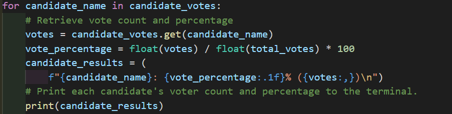

# Election_Analysis

## Project Overview
A Colorado Board of Election employee has given you the following tasks to complete the election audit of a recent local congressional election. My tasks were as follows:

1. Calculate the total number of votes cast.
2. Get a complete list of candidates who received votes.
3. Calculate total number of votes each candidate received.
4. Calculate the percentage of votes each candidate won.
5. Determine the winner of the election based on popular vote.

Also included are the following metrics pertaining to county turn out for the election:

1. Which counties were involved?
2. For each county involved: 
  - How many people voted?
  - What percentage of the votes were cast in the county?
3. Which county had the largest turnout?

## Resources
- Data Source: election_results.csv
- Software: Python 3.8.5, Visual Studio Code, 1.52.1

## Summary
### The analysis of the election show that:

- There were 369,711 total votes cast in the election.

This was one of the first code blocks, it is the first For loop that iterates over 
the text file while incrementally increasing to tally the total amount of votes cast.
It also reads the candidates name and the county name.

--------------------------------------------------------
#### County Data
--------------------------------------------------------
- The breakdown by county is as follows:
  * Arapahoe County had 24,801 votes, 6.7% of the total.
  * Denver County had 306,055 votes, 82.8% of the total. 
  * Jefferson County has 38,885 votes, 10.5% of the total.

The results above were generated by using a for loop to pull the county names, tally the votes and calculate the percentages.

- The county with the largest turnout was Denver. 

This code block includes an if decision statement that has two conditions. This if is within a for loop, that loop iterates over the results and resets the "winning..." variables every time it loops to determine which county best meets the parameters.

 ----------------------------------------------------------
 #### Election Results
 ----------------------------------------------------------
- The candidates were:
  - Charles Casper Stockham
  - Diana DeGette
  - Raymon Anthony Doane

 - The candidate results were:
  - Charles Casper Stockham received 23.0% of the vote and 85,213 number of votes.
  - Diana DeGette received 73.8% of the vote 272,892 number of votes.
  - Raymon Anthony Doane received 3.1% of the vote 11,606 number of votes

For the breakdown of the results for the candidates, I used another for loop to pullout the candidate names, tally the votes and calculate the percentages. To make sure that the percentage calculated properly 'float' data types were used.
 
- The winner of the election was:
  - Candidate: Diana DeGette, who received 73.8% of the vote and 272,892 number of votes.

As with the county tally results above an if decision statement within the for loop was used to determine which candidate won the election. The for loop iterates through the results and resets its' value everytime to the current row if the condidtions are met.

 
 
 ## Challenge Audit Summary - Proposal
 
 I am proposing that we utilize this same script for any election in the future with a few minor modifications. As I have mentioned above the For loops and If statements can be modified. 

1. Let's say that we have election results from the much larger presidential election. There will be multiple columns of candidates for many positions with each Ballot ID. We can add additional variables to our loop as seen here, right up under county name. We need only to modify the index number to desired position.
 - 1st we modify candidate_name to congressional_candidate, from here we proceed to call each variable we want to work with. 

2. Also this script is scalable, meaning we can add additional csv's to read and thus perform analysis all in one place. Notice here we are only loading one csv. 
 - file_to_load could be modified to file_to_load1 and we could add a file_to_load2
 

